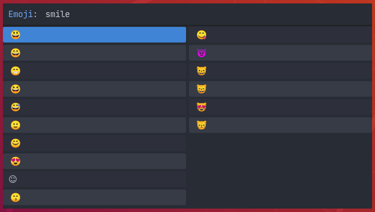

# Rofunicode - Unicode Character Picker for Rofi

## Installation

Just download the `rofunicode.sh` script whereever you want and give it executable permission:

```sh
curl --progress-bar https://raw.githubusercontent.com/MunifTanjim/rofunicode/master/bin/rofunicode.sh -o ~/.local/bin/rofunicode.sh
chmod u+x ~/.local/bin/rofunicode.sh
```

**Dependencies**:

- `rofi`
- `bash`
- `curl`
- Unicode Characters supported Fonts

## Configuration

Rofunicode configuration file is located at `~/.config/rofunicode/config.sh`:

```sh
#!/usr/bin/env sh

export ROFUNICODE_DATA_FILENAMES="emojis"
export ROFUNICODE_PROMPT="Emoji"
export ROFUNICODE_SKIN_TONE="dark" # neutral/light/medium-light/medium/medium-dark/dark
```

## Usage

Run the `rofunicode.sh` script and do whatever you want with the picked unicode character.

```sh
~/.local/bin/rofunicode.sh | xsel -i --clipboard
```

## Screenshot



## License

Licensed under the MIT License. Check the [LICENSE](./LICENSE) file for details.
